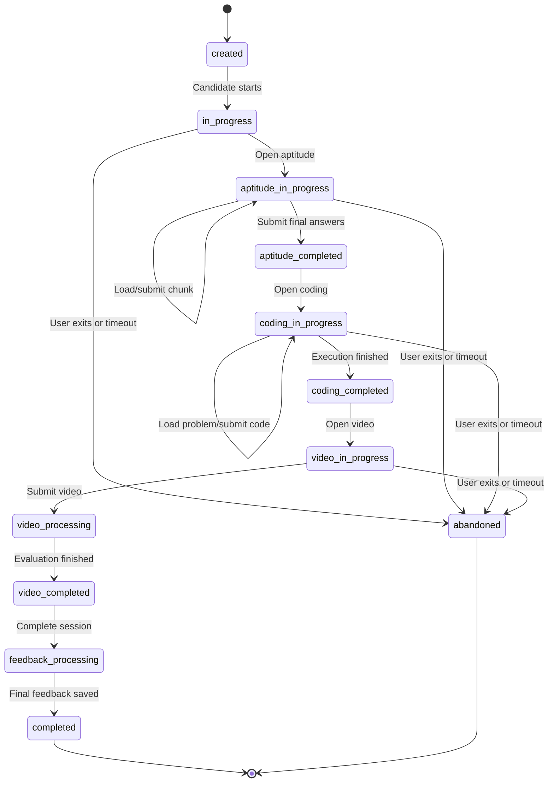

# NextRound Mock Interview Flow Specification

This document defines the expected mock interview flow for verification and implementation. It describes the complete candidate flow, backend responsibilities, database state, AI generation, queues, result processing, and acceptance criteria.

## 1. Goal

The mock interview must work as a progressive, stateful workflow:

- Create one mock interview session.
- Generate aptitude questions in small AI-generated chunks.
- Save every generated chunk and candidate answer.
- Generate or load one immutable coding problem per session.
- Execute submitted code only through an isolated sandbox worker.
- Generate or load video prompts and process video asynchronously.
- Aggregate all completed sections into final mock feedback.
- Never regenerate a different problem during submission.
- Never send correct answers or hidden test cases to the browser.

## 2. Main components

| Component | Responsibility |
|---|---|
| Candidate | Starts the session, answers questions, submits code, records video, views feedback. |
| Web app | Displays the workflow and calls API endpoints. It must not calculate scores or own hidden data. |
| API | Authenticates requests, validates input, checks ownership, reads/writes session state, and queues work. |
| Application service | Contains mock interview business logic without HTTP response handling. |
| Database | Stores session, question chunks, answers, coding problem, submissions, results, and final feedback. |
| Question generator | Generates validated AI questions and prevents duplicates. |
| Assessment worker | Processes aptitude scoring and stage transitions. |
| Sandbox worker | Runs candidate code in a real isolated environment. |
| Video worker | Transcribes and evaluates video submissions. |
| Feedback worker | Aggregates aptitude, coding, and video results into final feedback. |

## 3. Session lifecycle



## 4. Complete sequence

```mermaid
sequenceDiagram
    autonumber

    actor Candidate
    participant Web as Web App
    participant API as API
    participant Auth as Auth Middleware
    participant Service as Mock/Application Service
    participant DB as PostgreSQL
    participant AI as AI Generator
    participant Queue as Job Queue
    participant Sandbox as Code Sandbox
    participant Worker as Evaluation Worker
    participant Internal as Internal API

    Candidate->>Web: Click Start Mock Interview
    Web->>API: Create or load mock session
    API->>Auth: Validate authentication
    Auth-->>API: Candidate identity
    API->>Service: Create session
    Service->>DB: Load candidate and role context
    DB-->>Service: Candidate/job data
    Service->>DB: Create MockSession
    DB-->>Service: sessionId
    Service-->>API: Session configuration
    API-->>Web: sessionId and first section
    Web-->>Candidate: Show mock interview dashboard

    Web->>API: Request aptitude chunk 0
    API->>Auth: Validate candidate and ownership
    Auth-->>API: Authorized
    API->>Service: getAptitudeChunk(sessionId, chunkIndex=0)
    Service->>DB: Load aptitude assessment and prior chunks
    DB-->>Service: Existing chunks or empty state

    alt Chunk already stored
        Service->>DB: Read stored chunk
        DB-->>Service: Stored questions
    else Chunk missing
        Service->>AI: Generate aptitude chunk
        Note over Service,AI: Role, difficulty, chunk index, previous stems
        AI-->>Service: Candidate questions with correct answers
        Service->>Service: Validate schema and duplicate content
        Service->>DB: Store chunk and generation metadata
        DB-->>Service: Chunk persisted
    end

    Service->>Service: Remove correct answers
    Service-->>API: Sanitized chunk
    API-->>Web: Aptitude questions
    Web-->>Candidate: Display chunk

    loop Each aptitude chunk
        Candidate->>Web: Select answers
        Web->>API: Submit chunk answers
        API->>Auth: Validate candidate and session
        Auth-->>API: Authorized
        API->>Service: submitAptitudeChunk()
        Service->>DB: Save answers with chunk index
        DB-->>Service: Answers saved

        alt More questions required
            Service->>AI: Generate next chunk
            AI-->>Service: Next chunk
            Service->>Service: Validate and deduplicate
            Service->>DB: Persist next chunk
            DB-->>Service: Next chunk saved
            Service-->>API: Next chunk
            API-->>Web: Next questions
            Web-->>Candidate: Display next chunk
        else Final chunk
            Service-->>API: Aptitude section complete
            API-->>Web: Completion state
        end
    end

    Candidate->>Web: Submit final aptitude answers
    Web->>API: Submit final aptitude assessment
    API->>Auth: Validate candidate and session
    Auth-->>API: Authorized
    API->>Service: submitAptitude()
    Service->>DB: Load persisted questions and correct answers
    DB-->>Service: Stored assessment
    Service->>Service: Calculate score server-side
    Service->>DB: Save score and completion state
    Service->>Queue: Queue aptitude evaluation
    Queue-->>Worker: Process aptitude result
    Worker->>Internal: Store assessment result
    Internal->>DB: Update evaluation and section state
    DB-->>Internal: Result saved
    Service-->>API: Score and completion
    API-->>Web: Aptitude result
    Web-->>Candidate: Show aptitude completion

    Web->>API: Request coding problem
    API->>Auth: Validate candidate and session
    Auth-->>API: Authorized
    API->>Service: getCodingAssessment()
    Service->>DB: Load coding problem snapshot
    DB-->>Service: Existing problem or empty state

    alt No problem snapshot exists
        Service->>AI: Generate coding problem
        AI-->>Service: Problem, starter code, tests, entry point
        Service->>Service: Validate problem and reference solution
        Service->>DB: Save immutable problem snapshot
        DB-->>Service: Problem saved
    end

    Service->>Service: Remove hidden tests from response
    Service-->>API: Public coding problem
    API-->>Web: Problem and starter code
    Web-->>Candidate: Show coding editor

    Candidate->>Web: Submit code
    Web->>API: Submit code and language
    API->>Auth: Validate candidate, ownership, limits
    Auth-->>API: Authorized
    API->>Service: submitCoding()
    Service->>DB: Load exact problem snapshot
    DB-->>Service: Problem and hidden tests
    Service->>DB: Create CodingSubmission(status=queued)
    DB-->>Service: submissionId
    Service->>Queue: Queue code execution
    Queue-->>Sandbox: Execute submission
    Sandbox->>Sandbox: Compile using language toolchain
    Sandbox->>Sandbox: Run public and hidden tests
    Sandbox->>Sandbox: Compare typed outputs
    Sandbox->>DB: Store execution result
    Sandbox->>Internal: Send coding result
    Internal->>DB: Update submission and evaluation
    DB-->>Internal: Coding result saved
    Service-->>API: submissionId and queued status
    API-->>Web: Submission accepted
    Web-->>Candidate: Show running state

    loop Poll until terminal status
        Web->>API: Poll submission status
        API->>DB: Read CodingSubmission
        DB-->>API: queued/running/passed/failed/error
        API-->>Web: Current result
        Web-->>Candidate: Update result panel
    end

    Web->>API: Request video prompts
    API->>Auth: Validate candidate and session
    Auth-->>API: Authorized
    API->>Service: getVideoPrompts()
    Service->>DB: Load stored prompts or generate prompts
    DB-->>Service: Prompt set
    Service-->>API: Sanitized prompts
    API-->>Web: Video prompts
    Web-->>Candidate: Display prompt

    Candidate->>Web: Record video answers
    Web->>API: Submit video reference and metadata
    API->>Auth: Validate candidate and session
    Auth-->>API: Authorized
    API->>Service: submitVideo()
    Service->>DB: Save video submission
    DB-->>Service: Video submission saved
    Service->>Queue: Queue transcription/evaluation
    Queue-->>Worker: Process video
    Worker->>Worker: Transcribe video
    Worker->>Worker: Evaluate communication and answers
    Worker->>Internal: Send transcript and result
    Internal->>DB: Save video evaluation
    DB-->>Internal: Video result saved
    API-->>Web: Video processing status
    Web-->>Candidate: Show video completion state

    Candidate->>Web: Complete mock interview
    Web->>API: Complete session
    API->>Service: Complete mock session
    Service->>DB: Verify required sections completed
    DB-->>Service: Section results
    Service->>Queue: Queue final feedback
    Queue-->>Worker: Aggregate results
    Worker->>Worker: Calculate final score
    Worker->>Worker: Generate strengths and weaknesses
    Worker->>Worker: Generate improvement plan
    Worker->>Internal: Save final mock feedback
    Internal->>DB: Update MockSession(status=completed)
    DB-->>Internal: Final feedback saved
    Internal-->>API: Completed report
    API-->>Web: Final report
    Web-->>Candidate: Show score and recommendations
```



## 5. API contract

### 5.1 Create or load session

```http
POST /api/v1/mock/sessions
```

Request:

```json
{
  "targetRole": "Backend Engineer",
  "company": "Example Company",
  "difficulty": "medium"
}
```

Response:

```json
{
  "success": true,
  "data": {
    "sessionId": "mock_session_id",
    "status": "created",
    "currentSection": "aptitude"
  }
}
```

Required behavior:

- Authenticate the candidate.
- Create only one active session per intended workflow, or require an explicit restart.
- Store role, company, difficulty, generation seed, and assessment configuration.
- Do not generate the entire assessment during session creation.

### 5.2 Get aptitude chunk

```http
GET /api/v1/applications/{applicationId}/assessment/aptitude/chunk?chunkIndex=0&chunkSize=3
```

Response:

```json
{
  "success": true,
  "data": {
    "assessmentId": "assessment_id",
    "chunkIndex": 0,
    "chunkSize": 3,
    "questions": [
      {
        "id": "question_1",
        "category": "Logical Reasoning",
        "question": "Question text",
        "options": ["A", "B", "C", "D"],
        "difficulty": "medium"
      }
    ],
    "hasMore": true
  }
}
```

Required behavior:

- Validate `chunkIndex` and `chunkSize`.
- Verify candidate ownership.
- Return the stored chunk if it already exists.
- Generate only the requested chunk if it does not exist.
- Store the chunk before returning it.
- Remove `correctIndex`, answer explanations, and internal prompts from the response.
- Calculate `hasMore` using the configured total question count; do not always return `true`.

### 5.3 Submit aptitude chunk

```http
POST /api/v1/applications/{applicationId}/assessment/aptitude/chunk
```

Request:

```json
{
  "chunkIndex": 0,
  "chunkSize": 3,
  "answers": [
    {
      "questionId": "question_1",
      "selectedIndex": 2
    }
  ],
  "clientRequestId": "unique_request_id"
}
```

Required behavior:

- Validate the answer schema.
- Verify that every question belongs to the requested chunk.
- Reject duplicate submissions using `clientRequestId` or an idempotency key.
- Save answers without trusting a client-provided score.
- Generate the next chunk only after the current chunk is safely saved.
- Prevent two concurrent requests from generating duplicate chunks.

### 5.4 Final aptitude submission

```http
POST /api/v1/applications/{applicationId}/assessment/aptitude
```

Request:

```json
{
  "answers": [
    {
      "questionId": "question_1",
      "selectedIndex": 2
    }
  ],
  "totalTimeSeconds": 540,
  "tabSwitchCount": 1,
  "idempotencyKey": "unique_final_submission_key"
}
```

Required behavior:

- Load questions from the database.
- Calculate score using server-side correct answers.
- Do not trust the client score or correct-answer count.
- Mark the section complete only after all required questions are answered or explicitly submitted.
- Queue downstream evaluation after the transaction succeeds.

### 5.5 Get coding problem

```http
GET /api/v1/applications/{applicationId}/assessment/coding
```

Required behavior:

- Generate the problem once per session/assessment.
- Persist the complete problem snapshot.
- Store hidden tests on the server only.
- Return public tests without hidden inputs or expected outputs.
- Store the exact entry-point name and parameter schema.
- Never generate a new problem during code submission.

### 5.6 Submit coding solution

```http
POST /api/v1/applications/{applicationId}/assessment/coding
```

Request:

```json
{
  "code": "function solution(...) { ... }",
  "language": "javascript",
  "idempotencyKey": "unique_submission_key"
}
```

Required behavior:

- Do not accept test cases or expected outputs from the client.
- Validate language, code size, and submission limits.
- Load the persisted problem snapshot.
- Create a `CodingSubmission` with `queued` status.
- Queue exactly one execution job.
- Return a submission ID.

### 5.7 Poll coding submission

```http
GET /api/v1/applications/{applicationId}/assessment/coding/{submissionId}
```

Allowed statuses:

```text
queued
running
passed
failed
compile_error
runtime_error
timeout
memory_limit
cancelled
```

Required behavior:

- Verify that the submission belongs to the candidate and application.
- Do not expose hidden test inputs or expected values.
- Return safe compiler/runtime messages only.
- Store full infrastructure details in protected logs.

### 5.8 Get video prompts

```http
GET /api/v1/applications/{applicationId}/assessment/video-prompts
```

Required behavior:

- Persist prompts once per session.
- Generate prompts with AI if the product requires all questions to be AI-generated.
- Validate prompt count, length, category, and role relevance.
- Do not regenerate prompts on every page refresh.

### 5.9 Submit video

```http
POST /api/v1/applications/{applicationId}/assessment/video
```

Request:

```json
{
  "videoUrl": "https://storage.example/video.mp4",
  "durationSeconds": 120,
  "promptId": "video_prompt_1",
  "idempotencyKey": "unique_video_submission_key"
}
```

Required behavior:

- Verify the uploaded object belongs to the candidate.
- Validate duration and file type.
- Save metadata before queueing processing.
- Queue transcription and evaluation.
- Do not block the API request while processing video.

### 5.10 Complete mock session

```http
POST /api/v1/mock/sessions/{sessionId}/complete
```

Required behavior:

- Verify that required sections have terminal states.
- Prevent completion while a required section is still processing.
- Queue final feedback exactly once.
- Mark the session `feedback_processing` before queueing.
- Mark it `completed` only after final feedback is stored.

## 6. Database model requirements

### MockSession

```text
id
candidate_id
status
current_section
target_role
company
difficulty
generation_seed
started_at
completed_at
final_score
final_feedback
created_at
updated_at
```

### Assessment

```text
id
application_id
session_id
test_type
status
question_schema_version
questions
responses
score
category_breakdown
current_chunk_index
total_question_count
created_at
updated_at
```

### GeneratedQuestionChunk

```text
id
assessment_id
chunk_index
chunk_size
question_ids
questions
prompt_version
generation_seed
content_hash
created_at
```

### CodingProblemSnapshot

```text
id
assessment_id
problem_id
title
description
entry_point
parameter_schema
public_test_cases
hidden_test_cases
reference_solution_hash
problem_version
content_hash
created_at
```

### CodingSubmission

```text
id
assessment_id
candidate_id
problem_snapshot_id
code
language
status
pass_rate
execution_time_ms
memory_kb
result_summary
runner_version
sandbox_image_digest
created_at
completed_at
```

### VideoSubmission

```text
id
session_id
candidate_id
prompt_id
video_url
duration_seconds
status
transcript
score
feedback
created_at
completed_at
```

## 7. AI generation contract

Every generator must return structured data. Do not accept arbitrary text and attempt to parse it with a greedy regular expression.

### Aptitude question schema

```json
{
  "id": "aptitude_uuid",
  "category": "Quantitative Ability",
  "difficulty": "medium",
  "question": "Question text",
  "options": ["Option A", "Option B", "Option C", "Option D"],
  "correctIndex": 1,
  "explanation": "Why this answer is correct",
  "estimatedTimeSeconds": 60
}
```

### Coding problem schema

```json
{
  "id": "problem_uuid",
  "title": "Problem title",
  "description": "Problem description",
  "difficulty": "medium",
  "category": "Arrays",
  "entryPoint": "solution",
  "parameters": [
    { "name": "nums", "type": "number[]" }
  ],
  "returnType": "number",
  "starterCode": {},
  "publicTestCases": [],
  "hiddenTestCases": [],
  "referenceSolution": {},
  "expectedComplexity": {
    "time": "O(n)",
    "space": "O(1)"
  }
}
```

### Generator validation

Before storing any generated content:

1. Validate the complete schema.
2. Validate the question count.
3. Validate option count and `correctIndex`.
4. Reject duplicate IDs and duplicate normalized question text.
5. Validate that every coding language has compatible starter code.
6. Run coding test cases against a trusted reference solution.
7. Reject mismatched expected outputs.
8. Persist the prompt version and content hash.
9. Remove answer data from candidate-facing responses.

## 8. Verification checklist

### Session

- [ ] Candidate can create a session.
- [ ] Session ID is persisted.
- [ ] Refreshing the page does not create a second session.
- [ ] Candidate cannot access another candidate's session.
- [ ] Session status changes are persisted.
- [ ] A completed session cannot be submitted again.

### Aptitude

- [ ] First request generates only one chunk.
- [ ] Refreshing the same chunk returns the same questions.
- [ ] Questions are stored before being returned.
- [ ] Correct answers are never present in the browser response.
- [ ] Submitting a chunk saves answers.
- [ ] Next chunk is generated only once.
- [ ] Duplicate questions are rejected.
- [ ] Final `hasMore` becomes `false`.
- [ ] Final score is calculated on the server.
- [ ] Client-supplied score is ignored.
- [ ] Concurrent chunk requests do not duplicate questions.

### Coding

- [ ] Problem is generated once.
- [ ] Refreshing the page returns the same problem.
- [ ] Hidden tests are never returned.
- [ ] Client cannot provide test cases.
- [ ] Client cannot provide expected outputs.
- [ ] Exact entry point is stored.
- [ ] Code submission creates one submission ID.
- [ ] Duplicate requests are idempotent.
- [ ] Code runs only in the isolated sandbox.
- [ ] Network access is disabled in the sandbox.
- [ ] Secrets are unavailable in the sandbox.
- [ ] CPU, memory, process, filesystem, and output limits work.
- [ ] Wrong answers fail.
- [ ] Compile errors fail.
- [ ] Runtime errors fail.
- [ ] Timeout results are recorded.
- [ ] Hidden test details are not exposed.

### Video

- [ ] Prompts are persisted.
- [ ] Prompts are not regenerated on refresh.
- [ ] Video type and size are validated.
- [ ] Candidate ownership is checked.
- [ ] Video processing is asynchronous.
- [ ] Transcription status is visible.
- [ ] Evaluation results are stored.
- [ ] Duplicate video submission is prevented.

### Final feedback

- [ ] Final feedback is not generated before required sections finish.
- [ ] Final feedback job is idempotent.
- [ ] Aptitude score is included.
- [ ] Coding score is included.
- [ ] Video score is included.
- [ ] Strengths are based on actual results.
- [ ] Weaknesses are based on actual results.
- [ ] Final score is persisted.
- [ ] Session is marked completed only after feedback is saved.

## 9. Test scenarios

| Scenario | Expected result |
|---|---|
| Candidate refreshes aptitude chunk | Same chunk is returned; no new AI generation occurs. |
| Candidate submits the same chunk twice | Second request is idempotent; no duplicate answers or questions. |
| Two requests ask for the same next chunk simultaneously | Only one chunk is generated and stored. |
| Candidate changes `correctIndex` in request | Server ignores it and scores using stored answers. |
| Candidate sends custom coding tests | API rejects the request because tests are server-owned. |
| Candidate submits code twice with same idempotency key | One submission is created. |
| Candidate submits infinite loop | Sandbox terminates it with `timeout`. |
| Candidate tries to read environment variables | Sandbox has no secrets and returns failure safely. |
| Candidate tries outbound network access | Network is disabled. |
| Candidate requests another candidate's session | API returns `403` or an equivalent safe authorization response. |
| AI returns invalid JSON | Generator rejects it and uses a safe controlled fallback or retry. |
| AI returns duplicate questions | Duplicate questions are rejected and regenerated. |
| Video worker is unavailable | Session remains `video_processing`; it is not falsely marked complete. |
| Final feedback worker runs twice | Idempotency prevents duplicate or conflicting final feedback. |

## 10. Current implementation gaps to verify

The following items should be checked before considering the flow complete:

1. Disable the non-chunk aptitude endpoint for the mock interview path if chunk-only generation is required.
2. Ensure the chunk endpoint stores a total question count and returns a real `hasMore` value.
3. Add database locking or idempotency around chunk generation.
4. Ensure coding submission uses the exact persisted problem snapshot.
5. Replace host-level code execution with an isolated sandbox worker.
6. Confirm that polling checks submission ownership through the application/session.
7. Replace static video prompts with the AI generator if every question must be AI-generated.
8. Add runtime schemas for all candidate-facing mock endpoints.
9. Make final feedback wait for all required section results.
10. Add tests for retries, concurrent requests, hidden-answer leakage, sandbox escape attempts, and worker failures.

## 11. Definition of done

The mock interview flow is ready when:

- Every live question is generated or selected through the approved AI generation service, not directly from static JSON files.
- Aptitude questions are generated chunk-by-chunk.
- Every generated item is persisted and reproducible.
- Candidate answers are stored against stable question IDs.
- Coding problems and hidden tests are immutable per session.
- Code execution is isolated from the API host.
- Every async worker operation is retryable and idempotent.
- The browser never receives correct answers, hidden tests, API secrets, or internal stack traces.
- The final report is based only on completed, persisted section results.
- All verification checklist and test scenarios pass.
