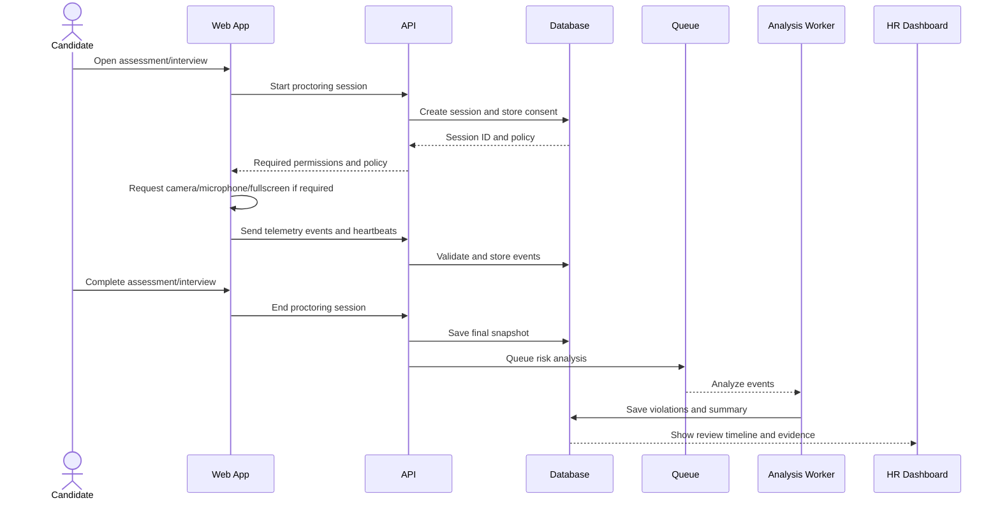

# NextRound Proctoring Implementation Plan

## Goal

Implement reliable security monitoring for aptitude, coding, and video interviews without fake security claims or automatic cheating decisions based on one browser signal.

## Existing integration points

- `apps/web/src/components/interview/InterviewCheckScreen.tsx`
- `apps/web/src/components/interview/UnifiedInterviewConsole.tsx`
- `apps/web/src/components/interview/UnifiedAssessmentSession.tsx`
- `apps/web/src/components/interview/ProctoringWarningModal.tsx`
- `apps/web/src/components/interview/AptitudeTestConsole.tsx`
- `apps/web/src/components/interview/CodingAssessmentConsole.tsx`
- `apps/api/src/routes/interviews/interview.routes.ts`
- `apps/api/src/routes/applications/application.routes.ts`
- `apps/api/src/services/application.service.ts`

Use one shared proctoring system. Do not add separate event listeners inside every component.

## Main flow



## Signals to implement

### Required first version

- Tab/page visibility changes.
- Window focus and blur.
- Fullscreen entered/exited.
- Heartbeat every 10 seconds.
- Camera permission and track state.
- Microphone permission and track state.
- Network disconnection/reconnection.
- Assessment start, pause, resume, and submit.

### Optional later version

- Local audio volume/voice activity metrics.
- Copy/paste counts for coding assessments.
- Device changes.
- Video transcription and interview analysis.

Do not capture raw keystrokes. Do not automatically judge accent, emotion, appearance, background noise, disability-related behavior, or face presence as cheating.

## Database tables

### `ProctoringSession`

```text
id
candidate_id
assessment_id nullable
application_id nullable
mock_session_id nullable
session_type
status
policy_version
consent_version
started_at
ended_at
last_heartbeat_at
created_at
updated_at
```

### `ProctoringEvent`

```text
id
proctoring_session_id
client_event_id
client_sequence
server_sequence
kind
severity
source
client_timestamp
server_received_at
session_elapsed_ms
payload_json
created_at
```

Add unique constraints for:

- `proctoring_session_id + client_event_id`.
- `proctoring_session_id + server_sequence`.

### `ProctoringViolation`

```text
id
proctoring_session_id
rule_code
severity
occurrence_count
first_seen_at
last_seen_at
status
reviewer_id nullable
review_reason nullable
created_at
updated_at
```

## API endpoints

```text
POST /api/v1/proctoring/sessions
POST /api/v1/proctoring/sessions/:id/events
POST /api/v1/proctoring/sessions/:id/heartbeat
POST /api/v1/proctoring/sessions/:id/pause
POST /api/v1/proctoring/sessions/:id/resume
POST /api/v1/proctoring/sessions/:id/end
GET  /api/v1/proctoring/sessions/:id/report
```

Every endpoint must:

- Authenticate the user.
- Verify candidate/session ownership.
- Validate input with Zod.
- Use server timestamps.
- Deduplicate events.
- Reject events after session closure.
- Return safe error messages.

## Frontend implementation

Create one shared client:

```text
apps/web/src/lib/proctoring/ProctoringClient.ts
apps/web/src/lib/proctoring/useProctoringSession.ts
apps/web/src/lib/proctoring/eventBuffer.ts
```

Responsibilities:

- Start and end the session.
- Generate event IDs and sequence numbers.
- Batch events.
- Retry failed event uploads.
- Send heartbeats.
- Monitor browser signals.
- Display warnings.

Integrate it into `UnifiedAssessmentSession` and `UnifiedInterviewConsole`, then pass session state to aptitude, coding, and video sections.

## Event rules

| Event | Default action |
|---|---|
| Short tab switch | Record and show warning if configured |
| Repeated/long tab switch | Mark for review |
| Fullscreen exit | Show warning and record duration |
| Heartbeat gap under 30 seconds | Record network issue |
| Heartbeat gap over policy limit | Pause or mark for review |
| Camera/microphone stopped | Warn or pause when required |
| Background noise | Record only; never auto-reject |
| Multiple possible voices | Low-confidence review signal only |

A single event must never automatically reject a candidate.

## Backend services

Create:

```text
apps/api/src/routes/proctoring/proctoring.routes.ts
apps/api/src/services/proctoring.service.ts
apps/api/src/services/proctoring-policy.service.ts
apps/api/src/validators/proctoring.schemas.ts
```

Use a policy configuration instead of hardcoded thresholds:

```json
{
  "version": "assessment-v1",
  "fullscreenRequired": true,
  "heartbeatIntervalSeconds": 10,
  "hiddenWarningCount": 1,
  "hiddenReviewCount": 4,
  "outsideFullscreenWarningSeconds": 5,
  "outsideFullscreenReviewSeconds": 30,
  "heartbeatReviewSeconds": 120
}
```

The browser may report events, but only the backend policy service decides severity and review status.

## Processing flow

1. Candidate opens the preflight screen.
2. Show consent and required permissions.
3. Create a server-side proctoring session.
4. Start browser signal monitoring.
5. Send events in batches.
6. Send heartbeat every 10 seconds.
7. Save all events with server timestamps.
8. On submit, flush pending events.
9. End the proctoring session.
10. Queue risk analysis.
11. Save violations and summary.
12. Show the HR review timeline.

## Error behavior

- Required permission denied: show a clear error and approved alternative process.
- Optional permission denied: continue and record unavailable status.
- Fullscreen unavailable: show an honest unsupported-state message.
- Network failure: retry and show reconnecting state.
- Event upload failure: buffer and retry; never silently discard.
- Worker failure: keep the session in `processing` or `error`; never create a fake report.

## Privacy and security

- Obtain explicit consent before camera, microphone, audio, or screen sharing.
- Store only required telemetry.
- Do not upload raw audio unless required and approved.
- Keep media in private encrypted storage.
- Use short-lived signed URLs.
- Restrict HR access by organization.
- Define retention and deletion jobs.
- Audit every report and media access.
- Provide an accessibility and technical alternative flow.

## Testing checklist

- [ ] Candidate can start and end a session.
- [ ] Candidate cannot access another candidate's session.
- [ ] Tab switch creates one deduplicated event.
- [ ] Fullscreen exit creates a warning.
- [ ] Heartbeat retries after network failure.
- [ ] Camera/microphone track ending is detected.
- [ ] Duplicate events are ignored.
- [ ] Events after session closure are rejected.
- [ ] Client cannot set severity or final risk decision.
- [ ] HR sees only organization-authorized reports.
- [ ] No raw keystrokes are captured.
- [ ] No fake report is created when analysis fails.
- [ ] Browser refresh and reconnect work correctly.
- [ ] Chrome, Edge, Firefox, and Safari behavior is tested.

## Claude Code execution order

1. Inspect the existing auth, Prisma schema, route registration, and interview components.
2. Add Prisma models and migration.
3. Add Zod request schemas.
4. Implement proctoring service and routes.
5. Implement the shared frontend proctoring client.
6. Add visibility, fullscreen, heartbeat, and media-track monitoring.
7. Integrate with unified interview and assessment components.
8. Add policy evaluation and HR timeline.
9. Add tests for permissions, retries, authorization, duplicates, and failures.
10. Run migration, typecheck, lint, unit tests, and integration tests.

## Definition of done

- Proctoring sessions are persisted and ownership-protected.
- Browser events are validated, deduplicated, and auditable.
- Tab, fullscreen, heartbeat, camera, and microphone states work.
- Policies are configurable and versioned.
- One signal never automatically rejects a candidate.
- Failed operations show real errors instead of fake results.
- Sensitive media and telemetry are protected and retained only as long as necessary.
- HR receives an explainable timeline and review status.
